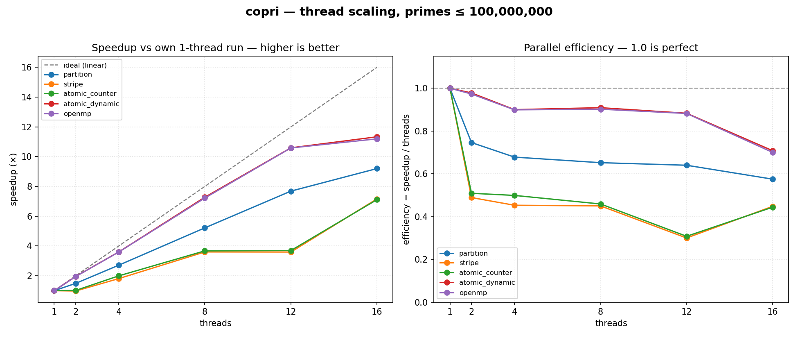
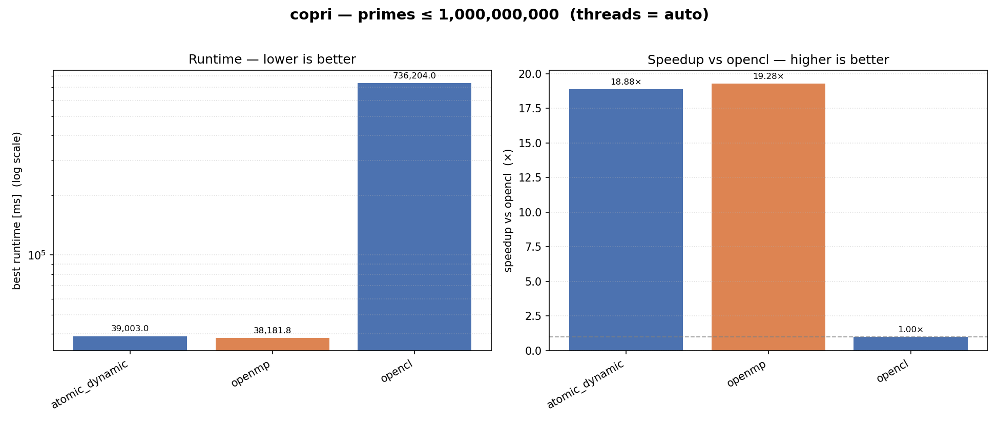
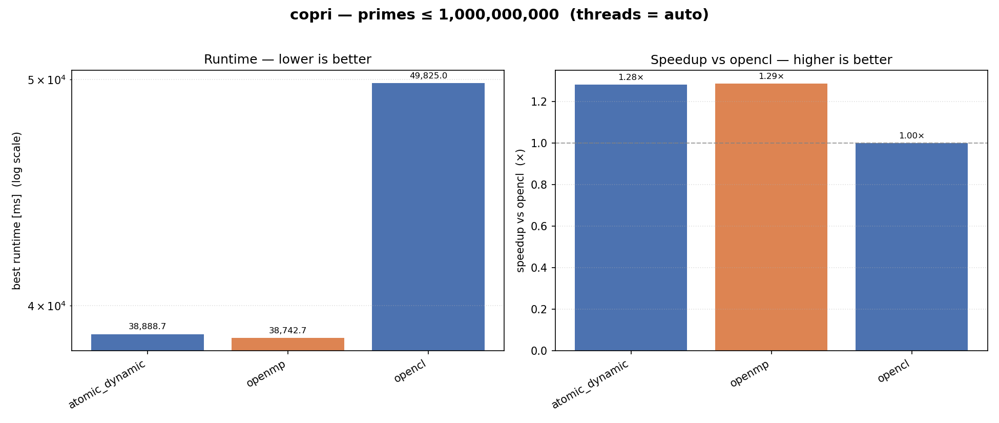
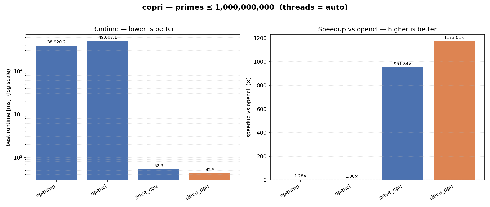
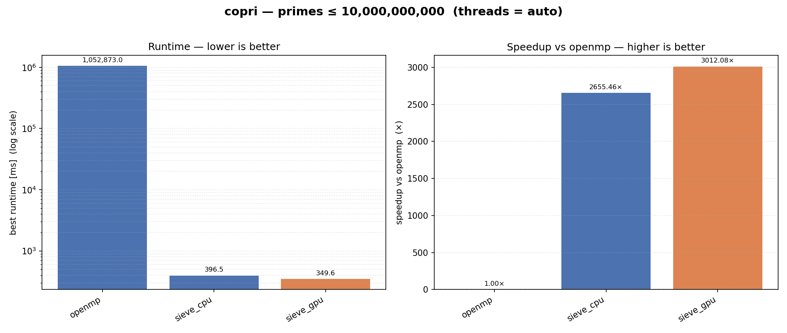
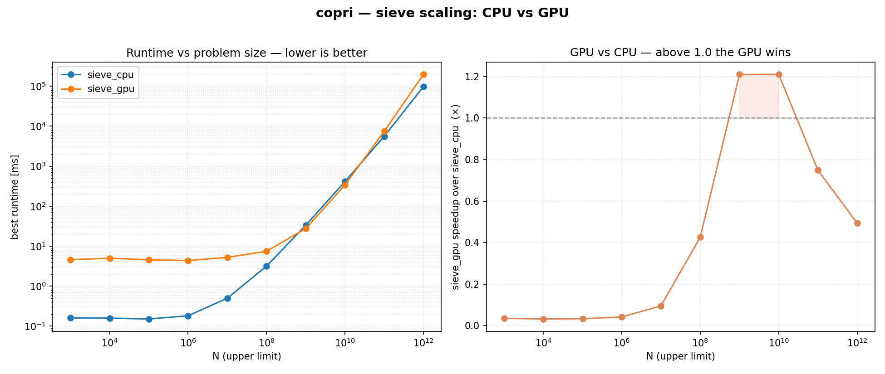
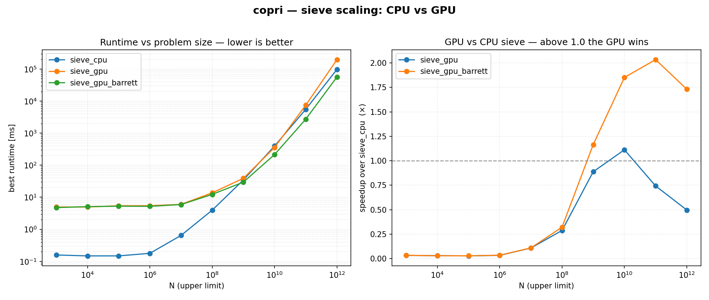

# A Random Walk to a Trillion
### A curiosity-driven travelogue through parallel prime counting on one laptop

> *The plan was simple: count the primes up to some limit, but do it in many
> parallel ways and see what's fastest. What actually happened was a two-week-feeling
> afternoon of wrong turns, humiliations, one genuine revelation, and a villain who
> kept coming back — until, on the last leg, we finally cornered it. This is the
> trip report — told in the order it happened, not the
> order a textbook would choose. It was Brownian motion in a solution space, and the
> only force pushing us around was curiosity.*

---

## Base camp: one rule, one machine

The machine: an Apple **M3 Max**, 16 CPU cores and a 40-core GPU sharing one pool
of memory. The quest: **count the primes ≤ N**. The rule, set on day one so the
comparisons would stay honest: *every version uses the exact same primality test*
— dead-simple trial division, `n % c` for odd `c` up to `√n`. We were not here to
test primality cleverly. We were here to **parallelize**.

We built a foundation worth standing on: one shared `is_prime`, a tiny timing
harness that prints a machine-readable line per run, a `Makefile` that quietly
skips toolchains it can't find, and a Python runner that benchmarks every binary,
**cross-checks that they all agree on the answer**, and writes a CSV. With that
scaffold, adding "another way to parallelize" became a 30-line file.

Then we started walking.

---

## Leg 1 — The cores wake up (and the GPU faceplants)

Five CPU strategies went in fast: a block **partition**, a cyclic **stripe**, a
**shared-atomic counter**, an **atomic work-stealing** dispatcher, and **OpenMP**.
At N=10⁷ the sequential baseline took **~628 ms**; the dynamic work-stealer did it
in **~55 ms** — about **11×**, right where 16 cores (a mix of fast performance and
slower efficiency cores) should land. The shared-atomic counter was visibly
slower than the identical-work striped version: one contended increment *per prime*
versus a private tally reduced once. Lesson logged: **synchronization granularity
is not free.**

Then we sent the job to the GPU via OpenCL, expecting fireworks. We got a faceplant:

> `opencl  N=10⁷  →  707 ms`  — **0.89×**. The 40-core GPU was *slower than a single
> CPU core.*

We shrugged, assumed "small problem, GPU overhead," and kept moving. (We were
wrong about *why*, and it would take us hours to find out.)

---

## Leg 2 — A detour into thread-count country, where we fell in a trap

Curiosity: *how does each strategy scale as we add cores?* So we built a sweep that
fixes N and varies the thread count, and it handed us the first real surprise.



The dynamic schedulers tracked the ideal line beautifully (~0.9 efficiency) until
the M3's four efficiency cores joined at 12→16 threads — the visible knee. But
**`stripe` and `atomic_counter` flatlined at ~0.5 efficiency on even thread
counts**, and *cratered to 0.30 at 12 threads.* 

The culprit was gorgeous. Striping with stride `P` over the integers means thread
`t` owns `t, t+P, t+2P, …`. When `P` is **even**, that stride shares the factor 2
with the numbers — so with 2 threads, thread 0 gets *only even numbers* (rejected
in one step) and thread 1 gets *all the odds* (the expensive ones). One thread does
all the work; two threads buy you nothing. We named it **the striping trap**: a
cyclic decomposition is only balanced if its stride is coprime to the structure of
the data.

We also took a short, instructive dead-end: an **OpenMP GPU-offload** version. It
compiled, it ran, and it cheerfully reported `offload devices = 0 → running on the
HOST`. Apple's GPU has no OpenMP offload back-end at all. We kept the version, made
it announce its own fallback honestly, and walked on.

---

## Leg 3 — The Billion, and a 736-second wall

We pointed everything at **N=10⁹** (π = 50,847,534). The fastest CPU version
finished in **~38 seconds**. The GPU?



> `opencl  →  736 seconds.` **More than twelve minutes.** ~**19× slower** than the CPU.

This was the low point of the expedition — and the turning point. A 40-core GPU
losing to 16 CPU cores by 19× isn't "overhead." Something was structurally wrong,
and we finally stopped to ask *what.*

---

## Leg 4 — The revelation: the villain is 64-bit division

The hot instruction in the whole program is `n % c` — an integer division. We had
been doing it in **64-bit** everywhere. So we asked a narrow question and measured
it in isolation: **what does the same loop cost in uint32 vs uint64?**

| where | uint64 | uint32 | speedup |
|---|---|---|---|
| CPU (one core, 10⁷) | 647 ms | 624 ms | **1.04×** — a yawn |
| GPU (OpenCL, 10⁷) | 714 ms | 58 ms | **12.4×** — !!! |

There it was. **The Apple GPU has no native 64-bit integer divide** — it emulates
it with a long sequence of 32-bit ops. The CPU's ARM cores divide 64-bit natively,
so they don't care. The GPU cared enormously. We taught every version a width knob
(`is_prime_uint32` / `is_prime_uint64`, auto-selected by N), and re-ran the Billion:



> `opencl uint32  →  49.8 seconds.` From 736 s to 50 s — **~15× faster**, gap to the
> CPU shrunk from **19×** down to **~1.3×**, purely by changing an integer type.

The GPU was never hopeless. *Trial division in 64-bit was.* The villain had a name.

---

## Leg 5 — "Is the Mac GPU just weak?" — no, the *algorithm* is

Even rescued, the GPU only *tied* the CPU. Was the laptop GPU simply underpowered?
Would an NVIDIA card change the story? We reasoned it through and concluded: a big
discrete GPU would win, but mostly by brute force — it would carry the *same* two
handicaps (warp divergence and emulated integer division). The real problem wasn't
the silicon. **It was trial division** — a divergent, division-bound algorithm that
no GPU is built to love.

So we changed the algorithm. We built a **Sieve of Eratosthenes** — CPU and GPU —
whose inner loop is `mark[j] = 1; j += 2p`: pure additions and byte writes, **zero
division.** The result reframed the entire trip:

> The CPU sieve counts π(10⁷) in **~0.8 ms.** Trial-division `seq` took **624 ms.**
> The *algorithm change* was ~**1000×** — nearly a hundred times bigger than
> everything parallelism had bought us.

And the GPU? Our **first** GPU sieve *lost* — 155 ms vs the CPU's 34 ms at 10⁹.
Another humiliation, another lesson: on a *unified-memory* Mac, our GPU sieve was
streaming a 500 MB array through the very RAM the CPU sieve never touches, because
the CPU sieve is **cache-blocked**. The fix was to block the GPU the same way —
sieve each segment in fast on-chip **`__local` memory**. That flipped it:



The sieves sit a thousand times below the trial-division bars, and **`sieve_gpu`
finally beats `sieve_cpu`.** On-chip blocking, not raw FLOPS, was the key.

---

## Leg 6 — The capstone: 17.5 minutes versus a third of a second

To feel the full gap we ran the best non-sieve CPU version against the sieves at
**N=10¹⁰** (π = 455,052,511):



| version | time |
|---|---|
| `openmp` (best parallel trial division) | **1,052,873 ms ≈ 17.5 minutes** |
| `sieve_cpu` | 396 ms |
| `sieve_gpu` | **350 ms** |

A ~**3000× algorithm gap.** The same 455 million primes counted in seventeen and a
half *minutes*, or a third of a *second*, depending only on the idea you bring. If
this whole trip has one postcard, it's this picture.

---

## Leg 7 — The summit push, and the villain's return

The GPU sieve led at 10⁹ and 10¹⁰. *Surely* it would run away with it at 10¹¹ and
10¹². We built a problem-size sweep from **10³ to 10¹²** to watch the GPU pull ahead.

It did not pull ahead. It **turned around.**



| N | sieve_cpu | sieve_gpu | GPU/CPU |
|---|---|---|---|
| 10⁶ | 0.18 ms | 4.4 ms | 0.04× |
| 10⁸ | 3.2 ms | 7.5 ms | 0.42× |
| **10⁹** | 33 ms | 28 ms | **1.21×** |
| **10¹⁰** | 413 ms | 341 ms | **1.21×** |
| 10¹¹ | 5.6 s | 7.5 s | 0.75× |
| 10¹² | 97 s | 197 s | 0.49× |

The GPU has a **sweet spot** — a window around **10⁹–10¹⁰** — and nothing more.
Below it, kernel-launch overhead drowns the tiny workload. Above it, the curve
*reverses* and the CPU pulls away to 2×.

And *why* it reverses is the punchline of the entire journey. The sieve's only
division is computing each prime's first multiple in each segment: `start % p` — a
**64-bit division** — once per base prime. The base-prime count grows like √N
(≈78,000 of them at 10¹²). The Apple GPU still has no native 64-bit divide, and its
32 KB on-chip segments are ~8× smaller than the CPU sieve's — so it pays that
emulated division ~8× more often. Past 10¹⁰, that setup cost overtakes the
bandwidth win.

**The villain was 64-bit integer division. Again.** It sank trial division on the
GPU, and now it caps the sieve. The same antagonist closed the loop on the last
page.

---

## Leg 8 — Slaying the villain with Barrett reduction

We had marked the next destination as a *bucket sieve* — a clever data structure
that visits each prime only in the segments where it actually has a multiple,
sidestepping the per-segment division. But staring at the map, we realised the
bucket sieve fights the GPU's grain (it wants sequential segments and atomic
lists), and that it was attacking a *symptom*. The disease was the same villain
we'd named twice already: **64-bit division.**

So we attacked the disease. **Barrett reduction** computes `x % p` with two
multiplies and a subtract instead of a divide — you precompute `μ = ⌊2⁶⁴/p⌋` once
per prime on the host (where division is cheap), then on the GPU:

```c
ulong q = mul_hi(x, mu);   // ≈ x / p, one multiply
ulong r = x - q * p;       // x mod p, off by ≤ ~2p
while (r >= p) r -= p;      // ≤ 2 fix-ups
```

One swap in the kernel — the divide became multiplies — and nothing else changed.
The reversal *vanished*:



| N | sieve_cpu | sieve_gpu (old) | sieve_gpu_barrett |
|---|---|---|---|
| 10¹⁰ | 397 ms | 358 ms | **215 ms** (1.85×) |
| 10¹¹ | 5556 ms | 7485 ms *(lost)* | **2732 ms** (2.03×) |
| 10¹² | 97.7 s | 196.9 s *(lost, 0.5×)* | **56.5 s** (1.73×) |

Where the plain GPU sieve cratered to half the CPU's speed at 10¹², Barrett *grew*
its lead to ~2× and held it. The orange line in the right panel crosses 1.0 around
10⁹ and never looks back. The GPU counts all **37,607,912,018** primes below a
trillion in **56 seconds** — beating the 16-core CPU outright — by refusing, one
last time, to do a single 64-bit division.

So the villain didn't get the last word after all. The whole trip had been one
long argument with integer division, and it ended the way it should: not by
buying a bigger GPU, not by a heroic data structure, but by *playing to the
hardware's strength* — turning the operation it hates (divide) into the one it
loves (multiply). The same `mul_hi`-for-`%` trick that rescued trial division
with uint32 closed the book on the sieve.

---

## Epilogue

We came to learn how to parallelize one tiny algorithm and ended up with a field
guide to a single laptop's soul: dynamic scheduling beats static; strides must be
coprime to your data; unified memory rewards staying on-chip; algorithm dwarfs
parallelism; and, above all, *know the one thing your hardware is bad at and
route around it*. For this GPU that one thing had a name we kept rediscovering —
64-bit integer division — and the journey was really the slow, curious,
measurement-by-measurement business of learning to stop asking it.

The map still has an unexplored road (a true bucket sieve, for when someone pushes
far past 10¹²). But that's a trip for another day. This one is done.

---

## Field notes (the lessons, in the order we learned them)

1. **Granularity matters** — an atomic per *result* costs more than an atomic per *chunk*.
2. **Dynamic beats static** — work-stealing kept all 16 cores busy to the end (~11×).
3. **The striping trap** — a cyclic stride must be coprime to the data's structure, or half your threads do nothing.
4. **Honest fallbacks** — OpenMP "GPU offload" silently ran on the CPU; we made it say so.
5. **Integer width is a GPU cliff** — uint32 vs uint64 was ~1× on the CPU but ~12× on the GPU.
6. **Algorithm ≫ parallelism** — the sieve was ~1000×; the cores were ~11×.
7. **Unified memory rewards on-chip blocking** — the GPU only won once it stopped streaming RAM.
8. **GPUs have an operating window**, not a monotonic advantage — bounded by overhead below and integer-division throughput above.
9. **The recurring villain** — 64-bit integer division explained almost every disappointment on the trip.
10. **Route around the weakness** — Barrett reduction turned the GPU's hated divide into multiplies and widened the window into a durable ~2× win to 10¹².

## Souvenirs (kept snapshots)

`results_m3max/copri_10e8` · `results_m3max/sweep_10e8` · `results_m3max/results_10e7_u32` · `results_m3max/results_10e7_both` ·
`results_m3max/results_10e9` · `results_m3max/results_10e9_u32` · `results_m3max/results_sieve_10e9` · `results_m3max/results_10e10` ·
`results_m3max/scale_sieve_3-12` · `results_m3max/scale_sieve_barrett_3-12` — each a `.csv` + `.png`, each a place we stood and measured.

*Largest number reached: 10¹². Primes counted there: 37,607,912,018, in 56 seconds
on the GPU. Lines of GPU code that mattered most: the ones that moved the working
set on-chip — and the three that turned a divide into a multiply.*
